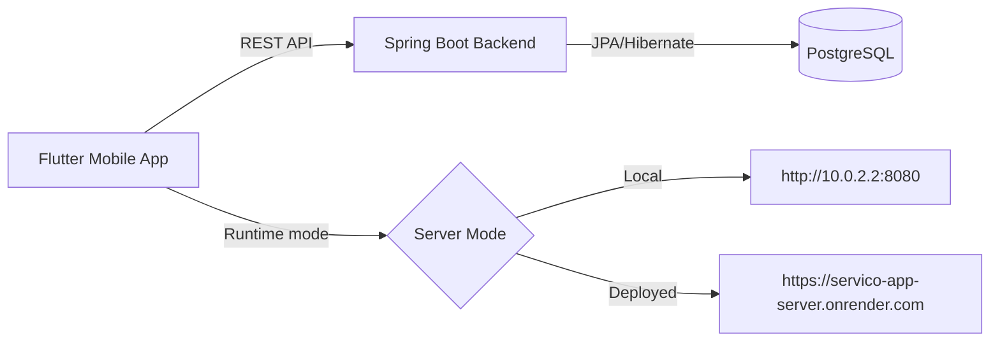

# Local Service Management

<p align="center">
  
</p>

<p align="center">
  Mobile + Backend platform to discover local services, manage provider profiles, book services, and track provider-side operations.
</p>

<p align="center">
  <a href="https://img.shields.io/badge/Backend-Spring%20Boot%203.2.5-6DB33F?logo=springboot&logoColor=white"></a>
  <a href="https://img.shields.io/badge/Java-17-007396?logo=openjdk&logoColor=white"></a>
  <a href="https://img.shields.io/badge/Flutter-SDK%20%3E%3D3.3.0-02569B?logo=flutter&logoColor=white"></a>
  <a href="https://img.shields.io/badge/Dart-3.x-0175C2?logo=dart&logoColor=white"></a>
  <a href="https://img.shields.io/badge/Database-PostgreSQL-4169E1?logo=postgresql&logoColor=white"></a>
  <a href="https://img.shields.io/badge/Deployment-Render-46E3B7?logo=render&logoColor=1A1A1A"></a>
  <a href="https://img.shields.io/badge/Container-Docker-2496ED?logo=docker&logoColor=white"></a>
</p>

## Stack Logos

<p>
  
  
  
  
  
  
  
  
</p>

## Table of Contents

- [What This Project Does](#what-this-project-does)
- [Tech Stack and Versions](#tech-stack-and-versions)
- [Architecture](#architecture)
- [Repository Structure](#repository-structure)
- [Core Features](#core-features)
- [API Snapshot](#api-snapshot)
- [Database Schema Overview](#database-schema-overview)
- [Quick Start](#quick-start)
- [Environment Variables](#environment-variables)
- [Run with Docker (Backend)](#run-with-docker-backend)
- [Testing and Quality Checks](#testing-and-quality-checks)
- [Postman Collection](#postman-collection)
- [Deployment Notes](#deployment-notes)
- [Troubleshooting](#troubleshooting)
- [Roadmap Ideas](#roadmap-ideas)

## What This Project Does

Local Service Management is a two-part system:

- A Flutter mobile app for customers and providers.
- A Spring Boot backend with PostgreSQL for data persistence.

The product flow includes:

- User/provider registration and login.
- Service discovery with filters (price, rating, distance, availability date).
- Booking creation and status tracking.
- Provider dashboard for service publishing and profile management.
- Provider earnings insights.
- Ratings/reviews and provider replies.
- Runtime server mode switching (local vs deployed backend) in the mobile app.

## Tech Stack and Versions

### Backend

| Layer | Technology | Version/Details |
|---|---|---|
| Language | Java | 17 |
| Framework | Spring Boot | 3.2.5 |
| Build Tool | Maven Wrapper | `backend/mvnw`, `backend/mvnw.cmd` |
| Data Access | Spring Data JPA | via Spring Boot 3.2.5 |
| API Layer | Spring Web (REST) | via Spring Boot 3.2.5 |
| Database Driver | PostgreSQL JDBC | runtime dependency, version managed by Spring Boot BOM |
| Testing | Spring Boot Test / JUnit 5 | via `spring-boot-starter-test` |

### Mobile

| Layer | Technology | Version/Details |
|---|---|---|
| Framework | Flutter | SDK `>=3.3.0 <4.0.0` |
| Language | Dart | SDK `>=3.3.0 <4.0.0` |
| HTTP Client | `http` | `^1.2.1` |
| Local Storage | `shared_preferences` | `^2.2.3` |
| Location | `geolocator` | `^12.0.0` |
| Reverse Geocoding | `geocoding` | `^3.0.0` |
| Media Picker | `image_picker` | `^1.1.2` |
| Permissions | `permission_handler` | `^11.4.0` |
| Typography | `google_fonts` | `^6.2.1` |
| Lint Rules | `flutter_lints` | `^3.0.2` |

### Android Build Toolchain (Mobile)

| Tool | Version |
|---|---|
| Android Gradle Plugin | 8.11.1 |
| Kotlin Android Plugin | 2.2.20 |
| Gradle Wrapper | 8.14 |
| Java Target (Android module) | 17 |

## Architecture



## Repository Structure

```text
Local-Service-Management/
|- backend/      # Spring Boot API service
|- Database/     # SQL schema and DDL
|- mobile/       # Flutter app (Android/iOS/Web/Desktop folders included)
|- Packages/     # Packaging/export related folders
```

## Core Features

### Customer Side (Mobile)

- Authentication flow with role-based routing.
- Service catalog with advanced filters:
  - min/max price
  - minimum rating
  - max distance (uses location)
  - availability date and only-available toggle
- Service booking and booking history.
- Review submission after completed bookings.
- Server selection UX (local/deployed backend) from app UI.

### Provider Side (Mobile + Backend)

- Provider dashboard with service management (create/update/delete).
- Provider profile update:
  - contact/address/state/city/pincode
  - experience, skills, bio
  - profile image upload/remove
- Live location sharing controls.
- Booking status updates and tracking notes.
- Earnings view endpoint and dashboard consumption.
- Review reply capability.

### Backend Capabilities

- REST endpoints for auth, services, users, bookings, reviews, provider insights.
- CORS origin pattern support via environment config.
- Health check endpoint for deployment readiness: `/healthz`.
- Startup service seeding for default service names.

## API Snapshot

Base URL options:

- Deployed: `https://servico-app-server.onrender.com`
- Local (Android emulator): `http://10.0.2.2:8080`

### Auth

| Method | Endpoint | Purpose |
|---|---|---|
| POST | `/auth/register` | Register user/provider |
| POST | `/auth/login` | Login |

### Services

| Method | Endpoint | Purpose |
|---|---|---|
| GET | `/services` | List services with optional filters |
| GET | `/services/types` | List service types |
| GET | `/services/provider/{providerId}` | Get provider's services |
| POST | `/services/provider` | Create service as provider |
| PUT | `/services/provider/{serviceId}` | Update provider service |
| DELETE | `/services/provider/{serviceId}?providerId=...` | Delete provider service |

### Users / Provider Profile

| Method | Endpoint | Purpose |
|---|---|---|
| GET | `/users/{userId}` | Get user profile |
| PUT | `/users/{userId}/provider-profile` | Update provider profile |
| PUT | `/users/{userId}/provider-location` | Update provider live location |
| POST | `/users/{userId}/profile-image` | Upload profile image (multipart) |
| DELETE | `/users/{userId}/profile-image` | Remove profile image |

### Bookings

| Method | Endpoint | Purpose |
|---|---|---|
| POST | `/bookings` | Create booking |
| GET | `/bookings/{userId}` | Get bookings by customer |
| GET | `/bookings/provider/{providerId}` | Get bookings by provider |
| PUT | `/bookings/{bookingId}/provider-status` | Provider status/tracking update |

### Reviews

| Method | Endpoint | Purpose |
|---|---|---|
| POST | `/reviews` | Create review |
| GET | `/reviews/provider/{providerId}` | Provider reviews |
| PUT | `/reviews/{reviewId}/reply` | Provider reply |

### Insights + Health

| Method | Endpoint | Purpose |
|---|---|---|
| GET | `/providers/{providerId}/earnings` | Provider earnings |
| GET | `/healthz` | Health check |

## Database Schema Overview

The primary tables in `Database/schema.sql`:

- `users`: user/provider identity and provider profile fields.
- `services`: catalog items tied to providers.
- `bookings`: booking lifecycle and tracking data.
- `reviews`: ratings and feedback linked to bookings.

Key constraints/index patterns included:

- role and status check constraints.
- phone/pincode validation checks.
- rating range check (`1..5`).
- indexes for high-frequency foreign key lookups.

## Quick Start

### Prerequisites

- Java 17
- PostgreSQL (local instance)
- Flutter SDK (compatible with Dart `>=3.3.0 <4.0.0`)
- Android Studio / VS Code + Flutter extension (for mobile development)

### 1) Clone

```bash
git clone <your-repo-url>
cd Local-Service-Management
```

### 2) Setup Database

From the `backend/` folder:

```powershell
createdb -U postgres lsm_db
psql -U postgres -d lsm_db -f ../Database/schema.sql
```

### 3) Run Backend

From `backend/`:

```powershell
.\mvnw.cmd spring-boot:run
```

Backend default port behavior:

- Uses `PORT` env var when provided.
- Falls back to `8080` locally.

### 4) Run Mobile App

From `mobile/`:

```powershell
flutter pub get
flutter run
```

At first launch, choose server mode:

- `Deployed` (recommended): hosted backend.
- `Local`: Android emulator URL `http://10.0.2.2:8080`.

## Environment Variables

### Backend (`backend/src/main/resources/application.properties`)

| Variable | Default | Purpose |
|---|---|---|
| `PORT` | `8080` | HTTP port |
| `DB_URL` | `jdbc:postgresql://localhost:5432/lsm_db` | PostgreSQL JDBC URL |
| `DB_USERNAME` | `postgres` | DB username |
| `DB_PASSWORD` | `postgres` | DB password |
| `CORS_ALLOWED_ORIGIN_PATTERNS` | localhost/127 patterns | CORS origin patterns |

Example setup (PowerShell):

```powershell
$env:DB_URL="jdbc:postgresql://localhost:5432/lsm_db"
$env:DB_USERNAME="postgres"
$env:DB_PASSWORD="your_password"
.\mvnw.cmd spring-boot:run
```

### Mobile (Optional compile-time overrides)

The app supports optional `--dart-define` values:

- `API_BASE_URL`
- `LOCAL_API_BASE_URL`
- `API_SERVER_MODE` (`local` or `deployed`)

Example:

```powershell
flutter run --dart-define=API_SERVER_MODE=local
```

## Run with Docker (Backend)

From `backend/`:

```bash
docker build -t lsm-backend .
docker run --rm -p 8080:8080 \
  -e DB_URL="jdbc:postgresql://host.docker.internal:5432/lsm_db" \
  -e DB_USERNAME="postgres" \
  -e DB_PASSWORD="postgres" \
  lsm-backend
```

Health check:

```bash
curl http://localhost:8080/healthz
```

## Testing and Quality Checks

### Backend

```powershell
cd backend
.\mvnw.cmd test
```

### Mobile

```powershell
cd mobile
flutter analyze
flutter test
```

## Postman Collection

Import this file into Postman:

- `backend/postman/local-service-management.postman_collection.json`

Suggested order:

1. Register
2. Login
3. Get Services
4. Create Booking
5. Get Bookings

## Deployment Notes

- Backend is ready for container deployment via `backend/Dockerfile`.
- Health endpoint for platform checks: `/healthz`.
- Backend port supports cloud runtime environments via `PORT`.

## Troubleshooting

| Problem | Likely Cause | Fix |
|---|---|---|
| Mobile cannot connect to backend | Wrong server mode/base URL | Switch mode from cloud icon in app header |
| Requests timeout | Backend sleeping/restarting or unreachable | Retry after warmup; confirm backend and DB are running |
| DB connection error at boot | Bad DB env vars | Verify `DB_URL`, `DB_USERNAME`, `DB_PASSWORD` |
| Location filter not working | Permissions disabled | Enable device location and app permission |
| Image upload fails | File too large or no permission | Keep image <= 3 MB and allow camera/gallery access |

## Roadmap Ideas

- JWT-based stateless authentication.
- Role-based backend authorization.
- Pagination and sorting support for service list API.
- Push notifications for booking status updates.
- Admin moderation panel for provider verification.
- CI pipeline for backend + mobile checks.

---
