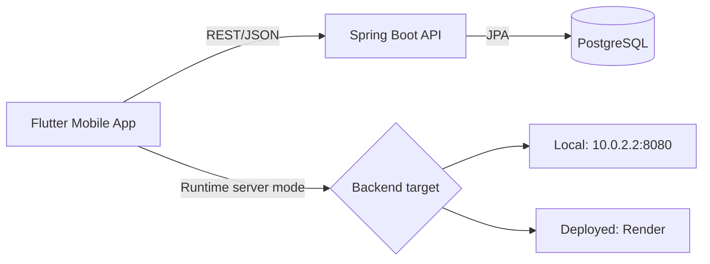
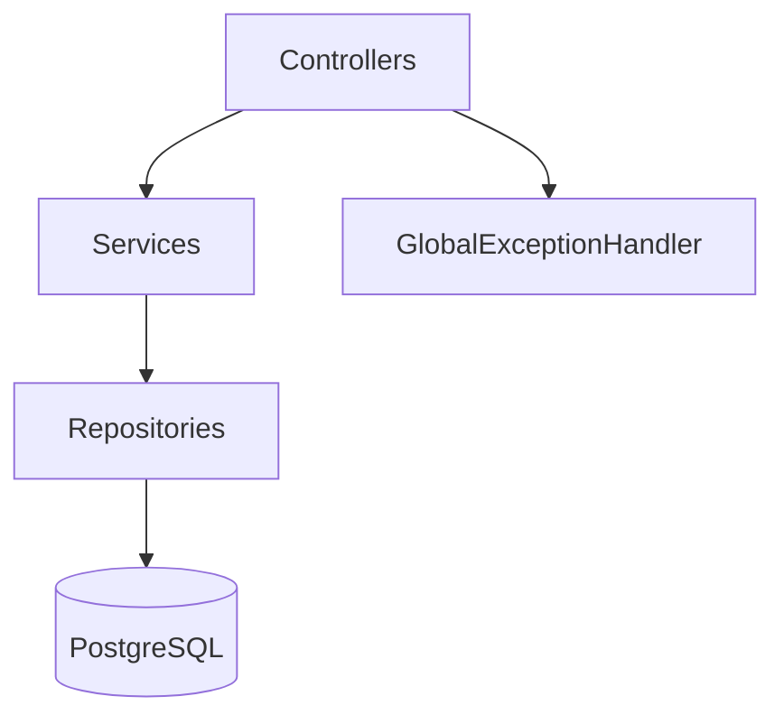
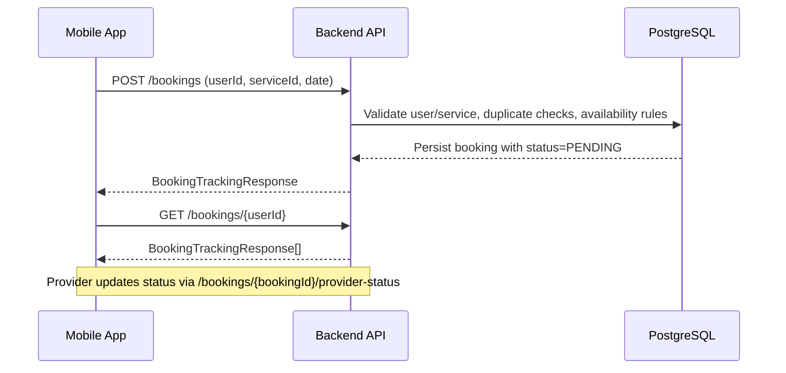
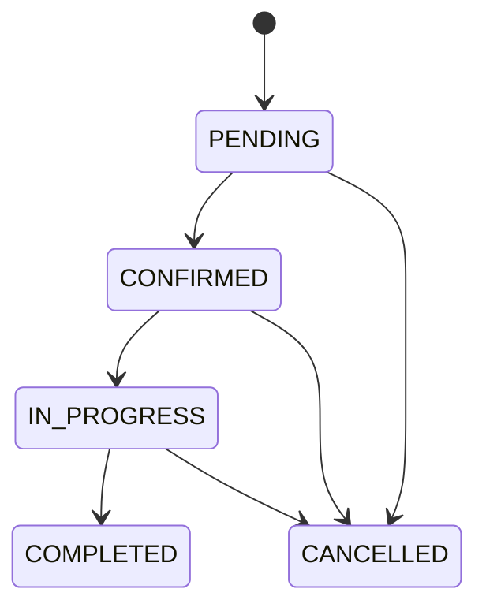
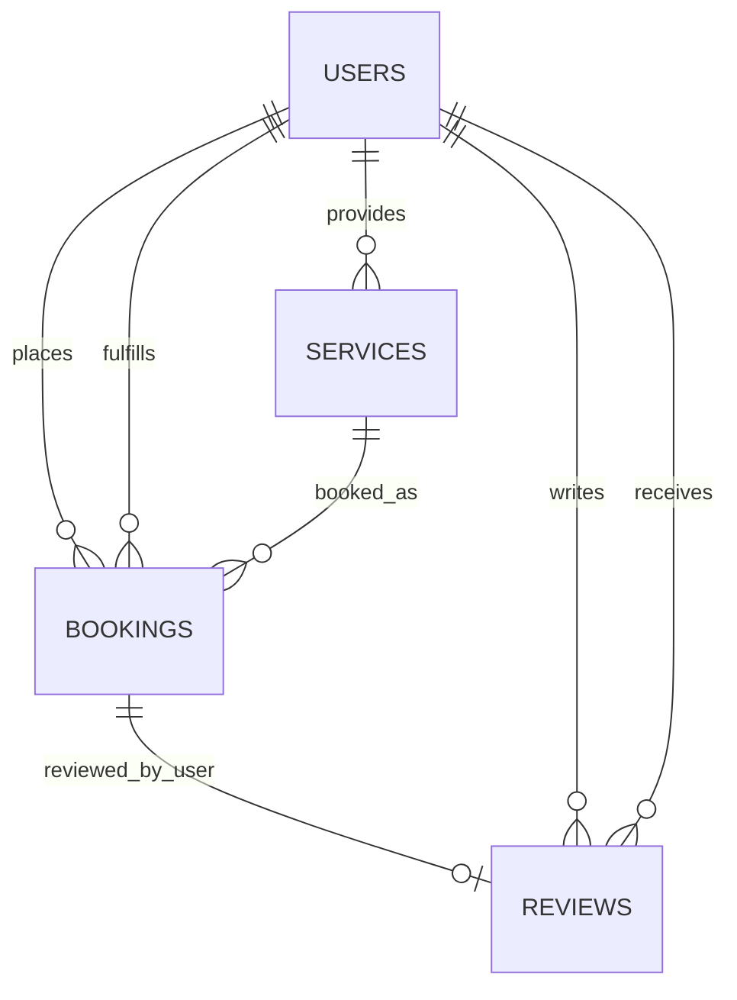

# Local Service Management

<p align="center">
  
</p>

<p align="center">
  Full-stack local-services platform with customer booking workflows, provider operations dashboard, and a production-ready Spring Boot API.
</p>

<p align="center">
  <a href="https://img.shields.io/badge/Backend-Spring%20Boot%203.2.5-6DB33F?logo=springboot&logoColor=white"></a>
  <a href="https://img.shields.io/badge/Java-17-007396?logo=openjdk&logoColor=white"></a>
  <a href="https://img.shields.io/badge/Flutter-SDK%20%3E%3D3.3.0-02569B?logo=flutter&logoColor=white"></a>
  <a href="https://img.shields.io/badge/Dart-3.x-0175C2?logo=dart&logoColor=white"></a>
  <a href="https://img.shields.io/badge/PostgreSQL-Database-4169E1?logo=postgresql&logoColor=white"></a>
  <a href="https://img.shields.io/badge/Deployment-Render-46E3B7?logo=render&logoColor=1A1A1A"></a>
  <a href="https://img.shields.io/badge/Container-Docker-2496ED?logo=docker&logoColor=white"></a>
</p>

## Tech Stack Icons (Large)

<table align="center">
  <tr>
    <td align="center" width="130">
      <br />
      <strong>Flutter</strong>
    </td>
    <td align="center" width="130">
      <br />
      <strong>Dart</strong>
    </td>
    <td align="center" width="130">
      <br />
      <strong>Spring Boot</strong>
    </td>
    <td align="center" width="130">
      <br />
      <strong>Java</strong>
    </td>
  </tr>
  <tr>
    <td align="center" width="130">
      <br />
      <strong>PostgreSQL</strong>
    </td>
    <td align="center" width="130">
      <br />
      <strong>Docker</strong>
    </td>
    <td align="center" width="130">
      <br />
      <strong>Kotlin</strong>
    </td>
    <td align="center" width="130">
      <br />
      <strong>Gradle</strong>
    </td>
  </tr>
</table>

## Documentation Index

- [Tech Stack Icons (Large)](#tech-stack-icons-large)
- [1. Executive Summary](#1-executive-summary)
- [2. Product Scope and Role Capabilities](#2-product-scope-and-role-capabilities)
- [3. Architecture and System Design](#3-architecture-and-system-design)
- [4. Technology Stack and Versions](#4-technology-stack-and-versions)
- [5. Domain Model and Data Schema](#5-domain-model-and-data-schema)
- [6. API Reference and Payload Examples](#6-api-reference-and-payload-examples)
- [7. Business Rules and Validation](#7-business-rules-and-validation)
- [8. Local Development Setup](#8-local-development-setup)
- [9. Configuration Matrix](#9-configuration-matrix)
- [10. Build, Test, and Quality Gates](#10-build-test-and-quality-gates)
- [11. Deployment and Operations Runbook](#11-deployment-and-operations-runbook)
- [12. Repository Layout](#12-repository-layout)
- [13. Known Gaps and Production Hardening](#13-known-gaps-and-production-hardening)
- [14. Roadmap](#14-roadmap)

## 1. Executive Summary

Local Service Management is a client-server platform designed for two primary personas:

- Customer: discover and book trusted local services.
- Provider: manage offerings, profile, bookings, reviews, and earnings.

### At a Glance

| Item | Value |
|---|---|
| Mobile App | Flutter app in `mobile/` |
| Backend API | Spring Boot app in `backend/` |
| Database | PostgreSQL (`lsm_db`) |
| Default Local API | `http://10.0.2.2:8080` (Android emulator) |
| Deployed API | `https://servico-app-server.onrender.com` |
| Health Endpoint | `/healthz` |

### Core Value

- Fast service discovery with filters and distance-aware search.
- Full booking lifecycle visibility.
- Provider-side operational dashboard (services, location, earnings, reviews).
- Practical cloud compatibility (dynamic port binding and Docker image).

## 2. Product Scope and Role Capabilities

| Capability | Customer | Provider |
|---|---|---|
| Register / Login | Yes | Yes |
| Browse services | Yes | Yes |
| Filter by price/rating/distance/date | Yes | No |
| Create booking | Yes | No |
| View booking history | Yes | Yes (provider-side view) |
| Submit review | Yes (post-completion) | No |
| Reply to review | No | Yes |
| Create/update/delete services | No | Yes |
| Manage profile image/details | Limited (`/users/{id}/profile`) | Full provider profile endpoints |
| Update live location sharing | No | Yes |
| View earnings insights | No | Yes |

## 3. Architecture and System Design

### 3.1 System Context



### 3.2 Backend Component View



### 3.3 End-to-End Booking Flow



### 3.4 Booking State Machine



## 4. Technology Stack and Versions

### 4.1 Backend

| Layer | Technology | Version / Notes |
|---|---|---|
| Language | Java | 17 |
| Framework | Spring Boot | 3.2.5 |
| Build | Maven Wrapper | `backend/mvnw`, `backend/mvnw.cmd` |
| API | Spring Web | REST controllers |
| Persistence | Spring Data JPA | Hibernate-backed |
| DB Driver | PostgreSQL | runtime dependency (managed by Spring Boot BOM) |
| Boilerplate Reduction | Lombok | optional |
| Tests | Spring Boot Test | JUnit 5 stack |

### 4.2 Mobile

| Layer | Package | Version |
|---|---|---|
| Framework | Flutter SDK | `>=3.3.0 <4.0.0` |
| Language | Dart SDK | `>=3.3.0 <4.0.0` |
| HTTP | `http` | `^1.2.1` |
| Multipart support | `http_parser` | `^4.0.2` |
| MIME detection | `mime` | `^1.0.6` |
| Local storage | `shared_preferences` | `^2.2.3` |
| Geolocation | `geolocator` | `^12.0.0` |
| Reverse geocoding | `geocoding` | `^3.0.0` |
| Image selection | `image_picker` | `^1.1.2` |
| Runtime permissions | `permission_handler` | `^11.4.0` |
| Typography | `google_fonts` | `^6.2.1` |

### 4.3 Android Toolchain (Mobile)

| Tool | Version |
|---|---|
| Android Gradle Plugin | 8.11.1 |
| Kotlin Android Plugin | 2.2.20 |
| Gradle Wrapper | 8.14 |
| Java target | 17 |

## 5. Domain Model and Data Schema

### 5.1 Core Entities

- users
- services
- bookings
- reviews

### 5.2 ER Diagram



### 5.3 Enums

| Enum | Values |
|---|---|
| Role | `USER`, `PROVIDER` |
| BookingStatus | `PENDING`, `CONFIRMED`, `IN_PROGRESS`, `COMPLETED`, `CANCELLED` |

### 5.4 Schema Constraints Worth Knowing

- `users.role` restricted to USER/PROVIDER.
- `users.contact_number` validated for Indian mobile format.
- `users.pincode` validated for Indian pincode format.
- `users.experience_years` validated from 0 to 60.
- `bookings.status` defaults to `PENDING` and enforces allowed values.
- `reviews.rating` constrained to 1..5.

## 6. API Reference and Payload Examples

### 6.1 Base URLs

- Local emulator mode: `http://10.0.2.2:8080`
- Deployed mode: `https://servico-app-server.onrender.com`

### 6.2 Endpoint Map

| Domain | Method | Endpoint | Description |
|---|---|---|---|
| Auth | POST | `/auth/register` | Register user/provider |
| Auth | POST | `/auth/login` | Login |
| Services | GET | `/services` | Catalog with optional filters |
| Services | GET | `/services/types` | Distinct service names |
| Services | GET | `/services/provider/{providerId}` | Provider service list |
| Services | POST | `/services/provider` | Create provider service |
| Services | PUT | `/services/provider/{serviceId}` | Update provider service |
| Services | DELETE | `/services/provider/{serviceId}?providerId=...` | Delete provider service |
| Users | GET | `/users/{userId}` | User profile |
| Users | PUT | `/users/{userId}/profile` | General user profile update |
| Users | PUT | `/users/{userId}/provider-profile` | Provider-specific profile update |
| Users | PUT | `/users/{userId}/provider-location` | Provider live location update |
| Users | POST | `/users/{userId}/profile-image` | Upload profile image |
| Users | DELETE | `/users/{userId}/profile-image` | Remove profile image |
| Bookings | POST | `/bookings` | Create booking |
| Bookings | GET | `/bookings/{userId}` | Customer bookings |
| Bookings | GET | `/bookings/{userId}?providerId=...` | Customer bookings filtered by provider |
| Bookings | GET | `/bookings/provider/{providerId}` | Provider bookings |
| Bookings | PUT | `/bookings/{bookingId}/provider-status` | Provider status update |
| Reviews | POST | `/reviews` | Create review |
| Reviews | GET | `/reviews/provider/{providerId}` | Provider reviews |
| Reviews | PUT | `/reviews/{reviewId}/reply` | Reply to review |
| Insights | GET | `/providers/{providerId}/earnings` | Earnings summary |
| Health | GET | `/healthz` | Service health check |

### 6.3 Example Contracts

<details>
  <summary>Auth: Register (Provider)</summary>

```http
POST /auth/register
Content-Type: application/json
```

```json
{
  "name": "Rahul Patil",
  "email": "rahul.provider@example.com",
  "password": "provider123",
  "role": "PROVIDER",
  "contactNumber": "9876543210",
  "address": "Flat 20, MG Road, Pune",
  "city": "Pune",
  "state": "Maharashtra",
  "pincode": "411001",
  "experienceYears": 6,
  "skills": "Plumbing,Leak repair",
  "bio": "Fast local service provider"
}
```

```json
{
  "userId": 12,
  "name": "Rahul Patil",
  "role": "PROVIDER",
  "message": "Registration successful"
}
```
</details>

<details>
  <summary>Services: Filtered Catalog Search</summary>

```http
GET /services?minPrice=200&maxPrice=1500&minRating=4&maxDistanceKm=12&userLatitude=19.0760&userLongitude=72.8777&onlyAvailable=true&availableDate=2026-04-22
```

```json
[
  {
    "id": 5,
    "name": "Plumber",
    "price": 499.0,
    "description": "Tap and leakage repair",
    "providerId": 8,
    "providerName": "Amit",
    "providerContactNumber": "9876543210",
    "providerAddress": "Andheri East",
    "providerCity": "Mumbai",
    "providerState": "Maharashtra",
    "providerPincode": "400069",
    "providerProfileImageUrl": null,
    "providerProfileImageBase64": null,
    "providerProfileImageContentType": null,
    "providerExperienceYears": 5,
    "providerSkills": "Plumbing",
    "providerBio": "Same-day visit",
    "providerVerified": false,
    "providerRatingAverage": 4.5,
    "providerTotalReviews": 22,
    "providerLiveLocationSharingEnabled": true,
    "providerLiveLatitude": 19.10,
    "providerLiveLongitude": 72.90,
    "providerLiveLocationUpdatedAt": "2026-04-21T16:10:30",
    "providerDistanceKm": 3.4,
    "available": true
  }
]
```
</details>

<details>
  <summary>Bookings: Create and Provider Status Update</summary>

```http
POST /bookings
Content-Type: application/json
```

```json
{
  "userId": 3,
  "serviceId": 5,
  "date": "2026-04-22"
}
```

```http
PUT /bookings/41/provider-status
Content-Type: application/json
```

```json
{
  "providerId": 8,
  "status": "IN_PROGRESS",
  "trackingNote": "Provider reached building entrance"
}
```

```json
{
  "id": 41,
  "userId": 3,
  "serviceId": 5,
  "serviceName": "Plumber",
  "servicePrice": 499.0,
  "providerId": 8,
  "providerName": "Amit",
  "date": "2026-04-22",
  "status": "IN_PROGRESS",
  "trackingNote": "Provider reached building entrance",
  "liveLocationSharingEnabled": true,
  "providerLatitude": 19.10,
  "providerLongitude": 72.90,
  "providerLocationUpdatedAt": "2026-04-21T16:30:00",
  "createdAt": "2026-04-21T15:20:00",
  "updatedAt": "2026-04-21T16:30:00",
  "reviewSubmitted": false
}
```
</details>

<details>
  <summary>Users: Update Profile and Upload Image</summary>

```http
PUT /users/3/profile
Content-Type: application/json
```

```json
{
  "name": "Riya Sharma",
  "contactNumber": "9876543210",
  "address": "Sector 21, Navi Mumbai",
  "city": "Navi Mumbai",
  "state": "Maharashtra",
  "pincode": "400706"
}
```

```bash
curl -X POST "http://localhost:8080/users/8/profile-image" \
  -F "file=@C:/images/provider.jpg"
```
</details>

<details>
  <summary>Reviews and Earnings</summary>

```http
POST /reviews
Content-Type: application/json
```

```json
{
  "bookingId": 41,
  "userId": 3,
  "rating": 5,
  "comment": "Quick and professional service"
}
```

```http
GET /providers/8/earnings?fromDate=2026-04-01&toDate=2026-04-30
```

```json
{
  "providerId": 8,
  "totalEarnings": 18500.0,
  "todayEarnings": 1200.0,
  "thisMonthEarnings": 7300.0,
  "pendingOrders": 3,
  "inProgressOrders": 1,
  "completedOrders": 26,
  "cancelledOrders": 2,
  "averageCompletedOrderValue": 711.54,
  "recentCompletedOrders": [
    {
      "bookingId": 55,
      "serviceName": "Electrician",
      "amount": 850.0,
      "date": "2026-04-20",
      "status": "COMPLETED"
    }
  ]
}
```
</details>

### 6.4 Error Model

The API uses a consistent error shape from global exception handling:

```json
{
  "message": "human-readable error"
}
```

## 7. Business Rules and Validation

| Rule Area | Enforced Behavior |
|---|---|
| Provider registration | Requires contact number, address, city |
| Mobile number validation | Must match Indian 10-digit format (`^[6-9]\d{9}$`) |
| Pincode validation | Must match 6-digit Indian format (`^[1-9]\d{5}$`) |
| Experience years | Allowed range is 0 to 60 |
| Booking date | Cannot be in the past |
| Duplicate booking protection | Same user and provider cannot keep active booking on same date |
| Cooldown protection | 5-minute cooldown for repeated booking with same provider |
| Status transitions | Provider can set `PENDING`, `CONFIRMED`, `IN_PROGRESS`, `COMPLETED`, `CANCELLED` |
| Service availability | `onlyAvailable=true` excludes services already blocked by active bookings |
| Profile image upload | Max size 3 MB; allowed types include jpg/jpeg/png/gif/webp/bmp |
| Live location update | Latitude and longitude must be provided together and within valid ranges |

## 8. Local Development Setup

### 8.1 Prerequisites

- Java 17
- PostgreSQL
- Flutter SDK compatible with Dart `>=3.3.0 <4.0.0`
- Android emulator/device for mobile testing

### 8.2 Clone Repository

```bash
git clone <your-repo-url>
cd Local-Service-Management
```

### 8.3 Database Setup

```powershell
cd backend
createdb -U postgres lsm_db
psql -U postgres -d lsm_db -f ../Database/schema.sql
```

### 8.4 Run Backend

```powershell
cd backend
.\mvnw.cmd spring-boot:run
```

### 8.5 Run Mobile App

```powershell
cd mobile
flutter pub get
flutter run
```

The app can run against deployed or local backend using server mode selection in UI.

### 8.6 Optional Quick Smoke Test

1. Register customer.
2. Register provider.
3. Provider creates service.
4. Customer books service.
5. Provider updates status to COMPLETED.
6. Customer submits review.

## 9. Configuration Matrix

### 9.1 Backend Environment Variables

| Variable | Default | Purpose |
|---|---|---|
| `PORT` | `8080` | HTTP listening port |
| `DB_URL` | `jdbc:postgresql://localhost:5432/lsm_db` | JDBC URL |
| `DB_USERNAME` | `postgres` | DB username |
| `DB_PASSWORD` | `postgres` | DB password |
| `CORS_ALLOWED_ORIGIN_PATTERNS` | localhost/127.0.0.1 patterns | CORS origins |

Example:

```powershell
$env:DB_URL="jdbc:postgresql://localhost:5432/lsm_db"
$env:DB_USERNAME="postgres"
$env:DB_PASSWORD="your_password"
.\mvnw.cmd spring-boot:run
```

### 9.2 Mobile Compile-Time Defines

| Define | Description |
|---|---|
| `API_BASE_URL` | Force fixed API base URL |
| `LOCAL_API_BASE_URL` | Override local mode URL |
| `API_SERVER_MODE` | Force `local` or `deployed` mode |

Example:

```powershell
flutter run --dart-define=API_SERVER_MODE=local
```

## 10. Build, Test, and Quality Gates

### 10.1 Backend

```powershell
cd backend
.\mvnw.cmd clean test
```

### 10.2 Mobile

```powershell
cd mobile
flutter analyze
flutter test
```

### 10.3 Postman Collection

Use:

- `backend/postman/local-service-management.postman_collection.json`

## 11. Deployment and Operations Runbook

### 11.1 Docker Build and Run (Backend)

```bash
cd backend
docker build -t lsm-backend .
docker run --rm -p 8080:8080 \
  -e DB_URL="jdbc:postgresql://host.docker.internal:5432/lsm_db" \
  -e DB_USERNAME="postgres" \
  -e DB_PASSWORD="postgres" \
  lsm-backend
```

### 11.2 Health Check

```bash
curl http://localhost:8080/healthz
```

Expected response:

```json
{
  "status": "ok"
}
```

### 11.3 Operational Notes

- Backend binds to `PORT` for cloud runtime compatibility.
- Dockerfile uses multi-stage build for smaller runtime image.
- Mobile app has a 45-second HTTP timeout and supports runtime target switching.

## 12. Repository Layout

This section gives a practical map of the repository so contributors can quickly locate where to implement features, fix bugs, and run validations.

### 12.1 Visual Directory Map

```text
Local-Service-Management/
|- README.md                                      # Root documentation
|- backend/                                       # Spring Boot backend service
|  |- src/main/java/com/lsm/backend/
|  |  |- controller/                              # REST API endpoint definitions
|  |  |- service/                                 # Business logic and workflow rules
|  |  |- repository/                              # Spring Data JPA data-access interfaces
|  |  |- dto/                                     # Request/response payload models
|  |  |- entity/                                  # Persistent entities and enums
|  |  |- exception/                               # Custom exceptions and global handler
|  |- src/main/resources/
|  |  |- application.properties                   # Runtime config and env placeholders
|  |- src/test/java/                              # Backend test sources
|  |- postman/
|  |  |- local-service-management.postman_collection.json
|  |- Dockerfile                                  # Container image build spec
|  |- pom.xml                                     # Maven dependencies and build config
|  |- mvnw / mvnw.cmd                             # Maven wrappers
|  |- target/                                     # Generated build artifacts (do not edit)
|- Database/
|  |- schema.sql                                  # SQL schema, constraints, and indexes
|- mobile/                                        # Flutter application
|  |- lib/
|  |  |- main.dart                                # App entrypoint
|  |  |- screens/                                 # Screen-level UI and flows
|  |  |- services/                                # API client and network integration
|  |  |- models/                                  # App models and JSON mapping
|  |  |- widgets/                                 # Reusable UI widgets
|  |  |- theme/                                   # Design system/theme config
|  |  |- utils/                                   # Validation and utility helpers
|  |- assets/                                     # App images/icons
|  |- test/                                       # Flutter test files
|  |- android/ ios/ web/ windows/ macos/ linux/  # Platform runners
|  |- pubspec.yaml                                # Flutter dependencies and assets
|  |- build/                                      # Generated Flutter artifacts (do not edit)
|- Packages/
|  |- Android/ Desktop/ iOS/ Linux/               # Packaging/output support folders
```

### 12.2 Folder Purpose Matrix

| Folder / File | Primary Purpose | Typical Changes You Make Here |
|---|---|---|
| `backend/src/main/java/com/lsm/backend/controller/` | API route layer | Add or modify endpoints, query/body parameters, response wiring |
| `backend/src/main/java/com/lsm/backend/service/` | Core business rules | Booking logic, validations, role checks, availability rules |
| `backend/src/main/java/com/lsm/backend/repository/` | Data access contracts | Add custom query methods and filters |
| `backend/src/main/java/com/lsm/backend/dto/` | API contracts | Add request/response fields used by mobile/client |
| `backend/src/main/java/com/lsm/backend/entity/` | Database entity model | Add columns/mappings and domain enums |
| `backend/src/main/resources/application.properties` | Environment configuration | Port, DB, CORS, logging and runtime config |
| `backend/postman/` | Manual API verification | Add/update request collections for QA and demos |
| `Database/schema.sql` | SQL DDL source of truth | Add constraints, indexes, and table updates |
| `mobile/lib/screens/` | App screen flows | UI changes, interaction flow, state handling |
| `mobile/lib/services/` | Backend integration layer | Add API methods, request/response handling, error parsing |
| `mobile/lib/models/` | Typed model mapping | JSON serialization/deserialization contract updates |
| `mobile/lib/widgets/` | Shared reusable UI | Common cards, banners, loaders, dialogs |
| `mobile/lib/theme/` | Styling system | Colors, typography, spacing, input/button themes |
| `mobile/lib/utils/` | Helper utilities | Validation helpers and data utilities |
| `mobile/assets/` | Static resources | App icons, images, brand assets |
| `mobile/test/` | Flutter tests | Widget/unit tests |
| `backend/target/`, `mobile/build/` | Build outputs | Generated during builds; not for manual edits |

### 12.3 Quick Navigation by Task

| If you want to... | Start here | Then also check |
|---|---|---|
| Add a new backend API | `backend/.../controller/` | `dto/`, `service/`, `repository/`, Postman collection |
| Add a new validation rule | `backend/.../service/` | `schema.sql` constraints, mobile form validation |
| Add a new database field | `backend/.../entity/` | `Database/schema.sql`, DTOs, mobile models |
| Add a mobile feature screen | `mobile/lib/screens/` | `services/`, `models/`, `widgets/`, `theme/` |
| Change backend endpoint payload | `backend/.../dto/` | `mobile/lib/models/`, `mobile/lib/services/api_service.dart` |
| Diagnose API integration bug | `mobile/lib/services/api_service.dart` | matching backend controller/service and DTO |

## 13. Known Gaps and Production Hardening

Current MVP strengths are solid for functional workflows, but production hardening should prioritize:

- Authentication security: passwords are currently compared directly; migrate to hashed passwords (for example BCrypt) and token-based auth (JWT).
- Authorization: introduce endpoint-level access controls beyond role checks in service code.
- Test depth: expand automated tests beyond context bootstrap tests.
- Observability: add structured logging, metrics, tracing, and alerting hooks.
- API governance: add OpenAPI/Swagger and versioning strategy.

## 14. Roadmap

### Near-term

- JWT authentication and refresh token flow.
- Authorization guards and stronger role-policy enforcement.
- Better provider availability scheduling.

### Mid-term

- Pagination/sorting across list endpoints.
- Push notifications for booking updates.
- Admin verification panel for providers.

### Longer-term

- CI/CD pipeline for backend and mobile.
- Performance/load testing and resilience tuning.
- Analytics and growth telemetry dashboards.

---

## Additional Project Docs

- Backend startup and quick reference: `backend/HELP.md`
- Mobile module notes: `mobile/README.md`

